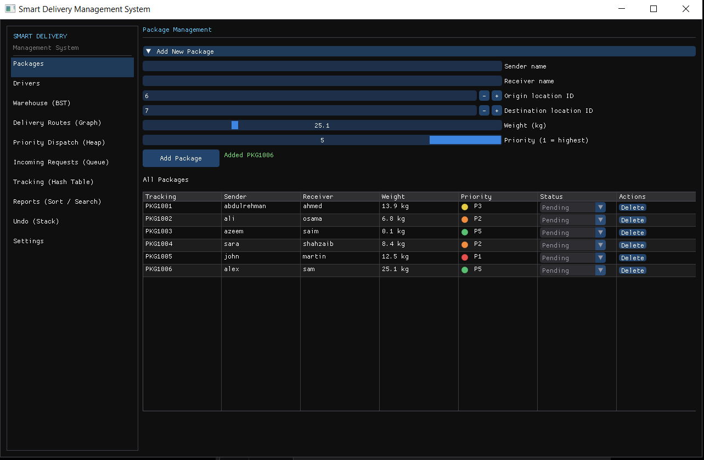
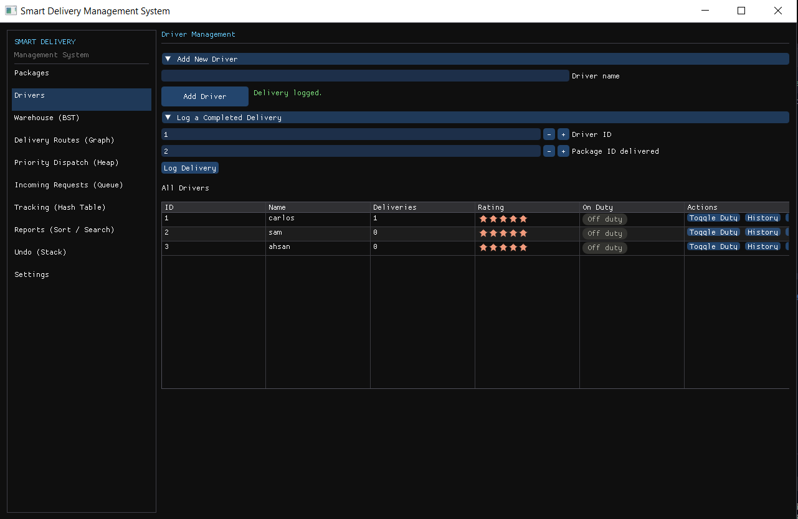
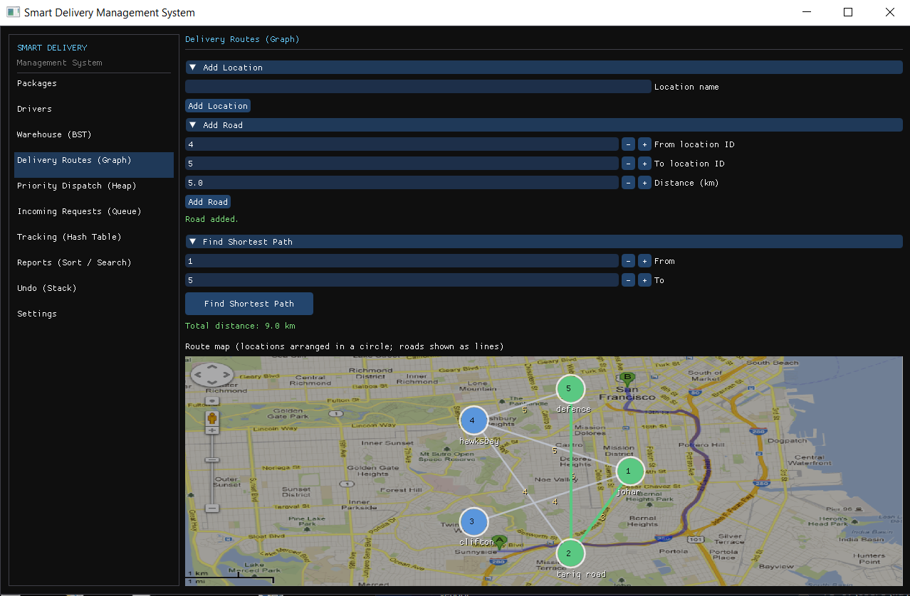

# 🚚 Smart Delivery Management System

> A comprehensive C++17 Smart Delivery Management System demonstrating the practical implementation of Data Structures and Algorithms in a real-world courier and logistics environment.


---

## 📖 Overview

Smart Delivery Management System is a real-world logistics and courier management application developed in **C++17**. The project demonstrates how fundamental **Data Structures and Algorithms** can be integrated into a single software solution to efficiently manage package tracking, warehouse inventory, delivery routes, priority dispatching, pickup requests, driver management, and performance analytics.

The project is available in two implementations:

- 🖥️ Console-based Text User Interface (TUI)
- 🎨 Desktop Graphical User Interface (GUI) built using Dear ImGui and SFML

Both implementations share the same core business logic while providing different user experiences.

## ✨ Key Features

- 📦 Package Management
  - Add, update, delete, and search packages
  - Track package status using unique tracking IDs

- 👨‍💼 Driver Management
  - Register and manage delivery drivers
  - Maintain complete delivery history
  - Driver performance leaderboard

- 🏬 Warehouse Inventory
  - Efficient inventory management using a Binary Search Tree (BST)
  - Fast item insertion, deletion, and searching

- 🗺️ Delivery Route Optimization
  - Manage delivery locations and road networks
  - Compute the shortest delivery route using Dijkstra's Algorithm
  - Interactive graphical route visualization

- 🚚 Priority Dispatch System
  - Automatically prioritize urgent deliveries using a Min Heap

- 🔍 Package Tracking System
  - Instant package lookup using a Hash Table with Separate Chaining

- 📋 Pickup Request Management
  - Process customer pickup requests using a Circular Queue (FIFO)

- ↩️ Undo Operations
  - Restore recently deleted package and driver records using a Stack

- 📊 Driver Performance Analytics
  - Compare driver rankings using Quick Sort and Merge Sort

- 🖥️ Dual User Interfaces
  - Console-based Text User Interface (TUI)
  - Desktop GUI built with Dear ImGui and SFML

  ---

## 🧠 Data Structures & Algorithms Implemented

| Data Structure / Algorithm | Purpose |
|----------------------------|---------|
| Arrays | Store packages, drivers, and locations using reusable slot indexing |
| Hash Table | Fast package tracking using tracking IDs |
| Binary Search Tree (BST) | Warehouse inventory management |
| Min Heap | Priority-based package dispatch |
| Graph (Adjacency List) | Represents the road network |
| Dijkstra's Algorithm | Computes the shortest delivery path |
| Doubly Linked List | Stores driver delivery history |
| Circular Queue | Handles pickup requests (FIFO) |
| Stack | Supports undo operations |
| Binary Search | Efficient priority-based package search |
| Quick Sort | Driver performance ranking |
| Merge Sort | Alternative driver ranking and performance comparison |

---

## 🛠️ Technologies Used

- **Language:** C++17
- **GUI Framework:** Dear ImGui
- **Graphics Library:** SFML
- **Compiler:** MinGW-w64 (UCRT64)
- **IDE:** Visual Studio Code
- **Build System:** g++
- **Version Control:** Git & GitHub

---

## 📂 Project Structure

```text
SmartDeliveryGUI/
│
├── include/          # Header files
├── src/              # Source files
├── vendor/           # Dear ImGui & ImGui-SFML
├── assets/           # Images and other resources
├── README.md
└── SmartDeliveryGUI.exe
```

---

## 🚀 Getting Started

### Prerequisites

Before building the project, make sure you have:

- C++17 Compiler (MinGW-w64 UCRT64)
- SFML
- Dear ImGui (included in the project)
- ImGui-SFML (included in the project)
- Visual Studio Code (recommended)

### Clone the Repository

```bash
git clone https://github.com/abdulrehman740494/Smart-Delivery-Management-System.git
cd Smart-Delivery-Management-System
```

### Build

Compile using g++:

```bash
g++ -std=c++17 ...
```

Or simply use the provided VS Code build task.

### Run

```bash
.\SmartDeliveryGUI.exe
```

---

## 📸 Application Preview

### Package Management



---

### Driver Management



---

### Delivery Routes

